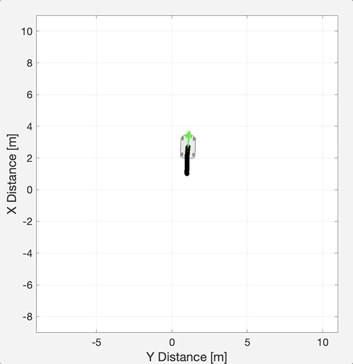

# **iXplore**: A user-guided input-based state-space explorer. 

iXplore is a utility tool to expore the sapled-time state-space of general systems. Systems (possibly dynamical) are treated as black-boxes having
- known initial state; 
- known input space; and
- some requirement to be satisfied within a bounded time.

# Requirements

Users provide the system description as update map and provide the requirements as a cost function that accepts an input trace and qualify it with a value from 0 to 1, where 0 means that the trace does not satisfy the requirements, 1 means the trace fully satisfy it, and values less than one refer to how much the trace is close to satisfy the requirement.

# Background

iXplore utilizes a moving time-window to limit the explosion of the branches of the input tree to fixed number of input traces. Each time-step, new traces are explored in the branching-time tree. As traces with higher satisfaction values are discovered, they are replaced with old traces of the lowest values. At the end of the time-bound, users are given the set of traces discovered and how much they satisfy the requirements. 

iXplore is intended to be parallized and implemented in the acceleration ecosystem pFaces. Currently, a MATLAB prototyple is made avalaible in this repo for discussion and improvement before the parallization of the technqie.

iXplore is very resilent to the size and dimensionality of the state-space, as it only explores the state-space form the input-space prespective. This becomes handy with systems that has large state-spaces and small input spaces. For example, we used iXplore to design a controller for a 7-dim BMW 320i vehilce to do a parallel park in a parking lot. Running the example's [MATLAB Script](matlab_prototype/ex_vehicle_park/simulate.m), will give you the following simulation:




# Usage

First, you need to define a matlab function that will rank a given input trace and assign a value to it from 0 to 1: 

```
function q = rankTrace(trace,options)
    % your code
    % evaluate trace with a value q \in [0,1]
end
```

Then, you make an input quantizer, for example:

```
is_lb = [-0.0, -0.0];
is_ub = [+0.4, +4.0];
is_eta = [0.2,  2.0];
is_quantizer = NdQuantizer(is_lb,is_ub, is_eta, zeros(size(is_lb)));
```

Finally, fill some options and launche the solver:

```
options.is_quantizer = is_quantizer;
options.global_time_bound = 100;
options.max_traces = 652;
options.break_if_all_traces_fail = true;
options.break_if_found = true;
options.verbose = true;

bestTraces = solveBranchAndBound(@rankTrace, options);
```

To save space, traces are qualized and flattened (i.e., encoded in 1-dim space). To unpack a trace, you may do:

```
first_trace = bestTraces(1,:);
trace_values = [];
for t=1:length(first_trace)
    trace_values = [trace_values is_quantizer.desymbolize(is_quantizer.unflatten(first_trace(i)))'];
end
```


Refer to the given examples for more ideas !

